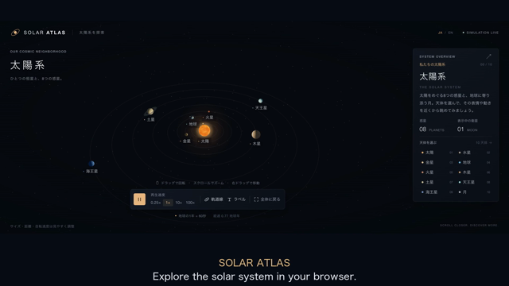

# SOLAR ATLAS

> 太陽系を、触って巡る。<br>
> An interactive 3D solar system for the browser.

## [▶ ブラウザですぐ体験する](https://takashiyoshinaga.github.io/SLAR-ATLAS/)

インストール不要です。PC・スマートフォンのブラウザからそのまま操作できます。

[](https://takashiyoshinaga.github.io/SLAR-ATLAS/)

太陽・8つの惑星・月を自由な視点から観察できる3Dコンテンツです。天体を選ぶとカメラが滑らかに接近し、公転する天体を追いながら表面、自転、軌道を眺められます。

HTML、CSS、素のJavaScript、Three.jsだけで構成しています。ビルドやパッケージのインストールは必要ありません。

## Features

- 太陽、8惑星、地球の月を3Dで表示
- 自転と公転を時間差分でアニメーション
- 天体の選択、滑らかな接近、カメラ追従
- 0.25× / 1× / 10× / 100×の速度変更と一時停止
- 軌道線、星空、太陽のグロー、土星の環
- CanvasTextureで生成する天体表面（外部画像不使用）
- 日本語 / EnglishのUIと天体解説
- マウス、タッチ、縦持ち、横持ちに対応
- スマートフォンでは「天体・解説・表示」を下部パネルに集約

## Controls

### PC

| 操作 | 動作 |
| --- | --- |
| 左ドラッグ | 視点を回転 |
| ホイール | ズーム |
| 右ドラッグ | 全景表示中に平行移動 |
| 天体・ラベル・一覧をクリック | 天体に接近して追従 |
| Space | 再生 / 一時停止 |
| Esc | 追従を解除して全景へ戻る |

### Smartphone / tablet

| 操作 | 動作 |
| --- | --- |
| 1本指でドラッグ | 視点を回転 |
| 2本指でピンチ | ズーム |
| 2本指で移動 | 全景表示中に平行移動 |
| 天体・ラベルをタップ | 天体に接近して追従 |
| 「天体」「解説」「表示」 | 下部パネルを切り替え |

追従中も回転とズームが可能です。選択中の天体、再生状態、速度、表示設定は、画面回転やレイアウト切り替えのあとも維持されます。

## Run locally

Python 3で静的サーバーを起動します。

```sh
python3 -m http.server 8000 --bind 127.0.0.1
```

[http://127.0.0.1:8000/](http://127.0.0.1:8000/) を開いてください。

Three.js 0.180.0とOrbitControlsをjsDelivr CDNから読み込むため、表示にはインターネット接続が必要です。ES Modulesを使用しているため、`index.html`を `file://` で直接開かず、HTTP経由でアクセスしてください。

## Simulation

地球の1公転を60秒として、各惑星の公転周期を地球との実際の比率に近づけています。月は約27.3日相当の周期で地球を回り、自転と公転を同期させて同じ面を地球へ向けます。

天体のサイズ、距離、自転速度は観察しやすいよう調整しています。軌道は円形・同一平面に簡略化しており、現在の天体位置や重力相互作用を計算する科学シミュレーターではありません。

## Tech stack

- HTML / CSS / JavaScript（ES Modules）
- [Three.js r180](https://github.com/mrdoob/three.js/tree/r180)
- [OrbitControls](https://github.com/mrdoob/three.js/blob/r180/examples/jsm/controls/OrbitControls.js)
- Canvas 2D / CanvasTexture

サーバーAPI、フレームワーク、ビルドツール、外部画像、外部フォント、分析・トラッキングは使用していません。

## Project structure

```text
index.html           画面構造、import map、起動エラー表示
styles.css           PC・スマートフォン向けUI
js/
  data.js            天体データ
  i18n.js            日本語・英語の文言
  label-layout.js    ラベル位置と表示判定
  layout.js          レスポンシブ判定とカメラ構図
  main.js            Three.js描画、カメラ、UI操作
  mobile-ui.js       下部パネルとフォーカス管理
  simulation.js      公転・自転・時間計算
  tap.js             マルチポインター対応のタップ判定
  textures.js        CanvasTexture生成
```

天体のサイズ、軌道半径、周期、解説は [`js/data.js`](js/data.js) のオブジェクト配列で管理しています。

## Browser support

WebGL2対応のSafari、Chrome、Edgeを対象としています。スマートフォン向けUIは幅360 CSS px以上、PCは1280×720以上を目安に調整しています。

> [!NOTE]
> iPhone Safari / Android Chromeでの実機タッチ操作、フレームレート、発熱は未確認です。

## References

- [NASA / JPL — Planetary Physical Parameters](https://ssd.jpl.nasa.gov/planets/phys_par.html)
- [NASA — Moon Facts](https://science.nasa.gov/moon/facts/)
- [Three.js r180](https://github.com/mrdoob/three.js/tree/r180) / [MIT License](https://github.com/mrdoob/three.js/blob/r180/LICENSE)

## License

This project is released under the [MIT License](LICENSE).
